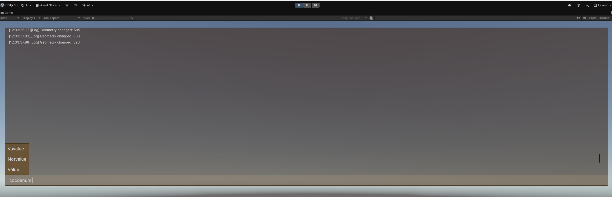
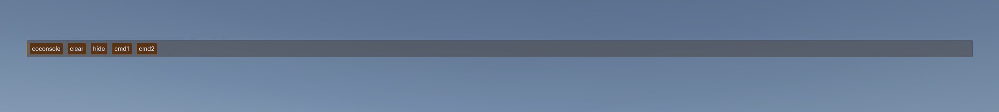

Implementation of a console for Unity. The vast majority of functionality uses Roslyn codegen.
- Autocomplete is supported for functions and enum arguments.

Two other samples
Coconsole - the actual console window. ~ Open - Esc close
CoconsoleButtons - an additional window that simply renders buttons for commands without arguments

To create your own functions, simply create a static class with the `[Coco]` attribute and methods with the `[Cmd]` attribute.

```c#
using Coconsole;
[Coco]
public static class CoconsoleDebugCommands
{
    public enum Test
    {
        Value,
        Notvalue,
        Vavalue,
    }

    [Cmd]
    public static void MyCommand(int p1)
    {
        Debug.Log($"Integer: {p1}");
    }
}
```


